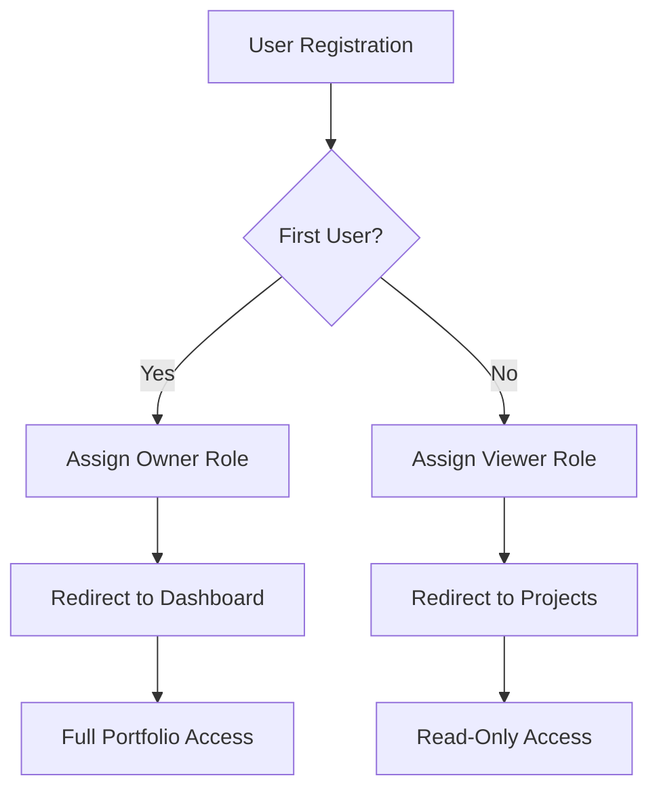

# Backend Integration Guide

This document explains how the portfolio frontend has been updated to work seamlessly with the backend API from `https://github.com/darunbjork/my-portfolio-os`.

## 🔧 Setup Instructions

### 1. Environment Configuration

Create a `.env` file in the root directory:

```bash
# Backend API URL
VITE_API_URL=http://localhost:3000/api/v1

# For production deployment
# VITE_API_URL=https://your-backend-domain.com/api/v1
```

### 2. Install Dependencies

The portfolio already includes all necessary dependencies:

```bash
npm install
```

### 3. Start the Development Server

```bash
npm run dev
```

## 🏗️ Architecture Overview

### Backend API Structure

The backend provides a comprehensive REST API with the following features:

- **Role-based Authentication** (owner, admin, viewer)
- **JWT Token Authentication**
- **CRUD operations** for projects, skills, and experience
- **User management** with role assignment

### Frontend Integration

The frontend has been updated with:

- **Type-safe API services** (`src/api/services.ts`)
- **Role-based authentication store** with Zustand
- **Protected routes** based on user roles
- **Consistent error handling**
- **Automatic token management**

## 🔐 Authentication & Roles

### User Roles

1. **Owner** 🔑
   - First registered user automatically becomes owner
   - Full administrative access
   - Can manage user roles
   - Can create, edit, delete all content

2. **Admin** 👨‍💼
   - Can manage portfolio content
   - Cannot manage user roles
   - Ideal for trusted collaborators

3. **Viewer** 👀
   - Read-only access to portfolio
   - Default role for new registrations
   - Can view all public content

### Authentication Flow



## 🛠️ API Services

### Authentication Services

```typescript
// Register new user
authAPI.register(email, password)

// Login user
authAPI.login(email, password)

// Get current user
authAPI.getMe()

// Manage users (Owner only)
authAPI.getUsers()
authAPI.updateUserRole(userId, role)
```

### Content Services

```typescript
// Projects
projectAPI.getAll()
projectAPI.getById(id)
projectAPI.create(projectData)  // Owner/Admin only
projectAPI.update(id, data)     // Owner/Admin only
projectAPI.delete(id)           // Owner/Admin only

// Skills
skillAPI.getAll()
skillAPI.create(skillData)      // Owner/Admin only
skillAPI.update(id, data)       // Owner/Admin only
skillAPI.delete(id)             // Owner/Admin only

// Experience
experienceAPI.getAll()
experienceAPI.create(expData)   // Owner/Admin only
experienceAPI.update(id, data)  // Owner/Admin only
experienceAPI.delete(id)        // Owner/Admin only
```

## 🎯 Key Features

### Role-Based UI

The interface adapts based on user permissions:

- **Anonymous users**: Can view portfolio content
- **Viewers**: Access to all portfolio pages
- **Admins/Owners**: Additional "Dashboard" and "Manage" buttons
- **Owners**: User management capabilities

### Automatic Token Management

- JWT tokens stored securely in localStorage
- Automatic token attachment to API requests
- Token validation and refresh handling
- Automatic redirect on authentication failure

### Error Handling

- Centralized error handling across all API calls
- User-friendly error messages
- Toast notifications for important actions
- Automatic retry mechanisms

## 🔄 State Management

### Authentication Store

```typescript
// Check authentication status
const { isAuthenticated, user } = useAuthStore()

// Role-based access checks
const { canManageContent, isOwner, isAdmin } = useAuthStore()

// Authentication actions
const { login, logout, setUser } = useAuthStore()
```

### Store Methods

- `hasRole(roles)`: Check if user has required role
- `canManageContent()`: Check if user can modify content
- `isOwner()`: Check if user is portfolio owner
- `isAdmin()`: Check if user is admin

## 🚀 Deployment

### Frontend Deployment

1. Build the application:
```bash
npm run build
```

2. Deploy to your preferred hosting platform (Vercel, Netlify, etc.)

3. Update environment variables:
```bash
VITE_API_URL=https://your-backend-domain.com/api/v1
```

### Backend Requirements

Ensure your backend is running with:
- Proper CORS configuration for your frontend domain
- Environment variables configured
- Database connection established
- JWT secret configured

## 🐛 Troubleshooting

### Common Issues

1. **API Connection Failed**
   - Check `VITE_API_URL` in `.env`
   - Verify backend is running
   - Check CORS configuration

2. **Authentication Not Working**
   - Clear localStorage: `localStorage.clear()`
   - Check JWT token validity
   - Verify API endpoints

3. **Role-Based Features Not Showing**
   - Refresh the page
   - Check user role in localStorage
   - Verify API response structure

### TypeScript Errors

If you encounter JSX or module resolution errors:

1. Update `tsconfig.json`:
```json
{
  "compilerOptions": {
    "jsx": "react-jsx",
    "moduleResolution": "node"
  }
}
```

2. Install missing type definitions:
```bash
npm install -D @types/react @types/react-dom
```

## 🔗 API Endpoints Reference

### Public Endpoints
- `GET /api/v1/projects` - Get all projects
- `GET /api/v1/projects/:id` - Get project by ID
- `GET /api/v1/skills` - Get all skills
- `GET /api/v1/experience` - Get all experience
- `POST /api/v1/auth/register` - User registration
- `POST /api/v1/auth/login` - User login

### Protected Endpoints (Owner/Admin)
- `POST /api/v1/projects` - Create project
- `PUT /api/v1/projects/:id` - Update project
- `DELETE /api/v1/projects/:id` - Delete project
- `POST /api/v1/skills` - Create skill
- `PUT /api/v1/skills/:id` - Update skill
- `DELETE /api/v1/skills/:id` - Delete skill
- `POST /api/v1/experience` - Create experience
- `PUT /api/v1/experience/:id` - Update experience
- `DELETE /api/v1/experience/:id` - Delete experience

### Owner-Only Endpoints
- `GET /api/v1/auth/users` - List all users
- `PUT /api/v1/auth/users/:userId/role` - Update user role

## 🎨 UI Components

### Updated Components

- **Header**: Shows user role badges and role-based navigation
- **Projects**: Role-based content management buttons
- **Dashboard**: Full content management interface
- **Login/Register**: Enhanced with role feedback
- **ProtectedRoute**: Role-based route protection

### Role Badges

- **Owner**: Purple badge with full access
- **Admin**: Blue badge with content management
- **Viewer**: Green badge with read-only access

## 📝 Usage Examples

### First-Time Setup

1. Start both backend and frontend
2. Navigate to `/register`
3. Register first user (becomes owner automatically)
4. Start creating portfolio content

### Content Management

1. Login as owner/admin
2. Navigate to `/dashboard`
3. Create/edit projects, skills, experience
4. View changes immediately on public pages

### User Management (Owner Only)

1. Login as owner
2. Navigate to dashboard
3. View user list
4. Promote users to admin if needed

This integration provides a complete, secure, and scalable portfolio solution with proper role-based access control and modern development practices.